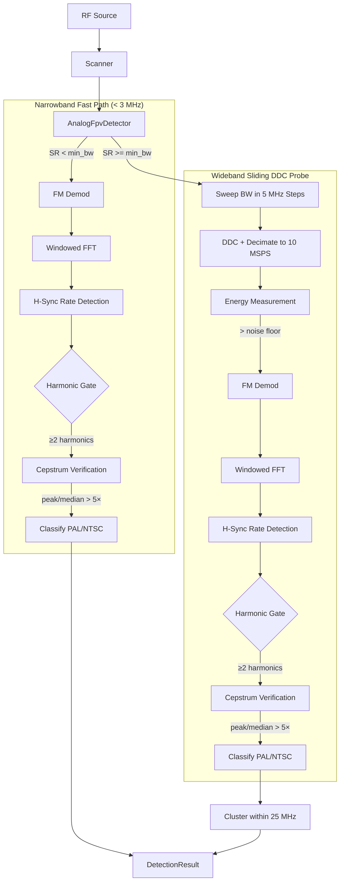

# Design: FPV Analog Drone Detection (fpv-drone-analog-rs)

This document outlines the architectural and mathematical design of the `fpv-drone-analog-rs` crate, a high-confidence detection system for analog FPV drone video signals.

## 1. Introduction
Detecting analog FPV (First Person View) drones requires distinguishing a wideband FM video signal (typically 10-20 MHz wide) from common interference like Wi-Fi (20/40 MHz) and narrowband noise. This crate employs a **sliding DDC probe** pipeline that sweeps across the capture bandwidth, FM-demodulates at each position, and searches for characteristic video sync line rates.

## 2. System Architecture

The system is designed to be hardware-agnostic, interacting with RF frontends through abstracted I/Q data buffers.

## 3. Detection Logic

### Narrowband Fast Path
When `sample_rate < min_bandwidth` (3 MHz), the signal is assumed to already be isolated at baseband. The detector runs FM demodulation and sync pulse detection directly.

### Wideband Sliding DDC Probe
For wideband captures (e.g., 100 MSPS), the detector sweeps the entire capture bandwidth:

1. **Probe Grid**: The bandwidth is divided into 5 MHz steps with a 5 MHz margin at each edge. For 100 MSPS, this yields ~18 probe positions.

2. **DDC + Decimation**: At each probe position, a Digital Down-Converter (NCO mixer) shifts the probe frequency to DC, then a boxcar low-pass filter decimates to 10 MSPS. This isolates a ~10 MHz slice around each probe center.

3. **Energy Gating**: Mean power is computed at each probe position. The **25th percentile** of all probe energies is used as a robust noise floor estimate (resistant to FM signals covering large fractions of the bandwidth). Probes with energy ≥ 3 dB above this noise floor proceed to sync validation.

4. **FM Demodulation**: The isolated I/Q is FM-demodulated via the differentiate-and-multiply discriminator: `arg(z[n] × conj(z[n-1]))`. This recovers the baseband video signal where sync pulses are encoded as instantaneous frequency excursions.

5. **Sync Pulse Detection**: A Hann-windowed FFT of the demodulated signal searches for spectral peaks at the H-sync line rates:
   - **PAL**: 15,625 Hz (bin = `round(15625 / bin_hz)`)
   - **NTSC**: 15,734 Hz (bin = `round(15734 / bin_hz)`)

   When FFT resolution is sufficient to resolve both rates into distinct bins (bin_hz < 109 Hz, requiring > 9.2 ms of data), the detector classifies PAL vs NTSC directly from the spectrum. When the bins collide (e.g. a 2.6 ms chunk at 25 MSPS gives ≈ 381 Hz/bin), the detector falls back to a **time-domain median sync-tip interval** measured on the FM-demodulated record (`classify_pal_ntsc_time_domain`): the median line period maps to a line rate that's compared against PAL (15625 Hz) and NTSC (15734 Hz), with a ±30 Hz dead-band around the midpoint. Only if that fallback is also inconclusive (too few sync tips, or the median lands in the dead-band) does the burst get tagged `AnalogVideoUnknown` rather than committing to a standard. Callers gate on `SignalType::is_analog_video()` when they want the "is this an analog FPV signal at all?" answer without committing to a PAL/NTSC label.

6. **Harmonic-Consistency Check**: H-sync is a ~7 % duty-cycle rectangular pulse train; its FM-demodulated spectrum has the fundamental at the line rate plus a rich harmonic series (sinc-envelope coefficients keep the first ~14 harmonics within roughly −3 dB of the fundamental). A CW interferer or narrowband-FM tone that happens to land in the line-rate bin produces a fundamental ONLY. The detector counts how many of the first 5 harmonics exceed 10 % of the fundamental amplitude — at least 2 are required for a positive classification. Threshold is fundamental-relative (not noise-floor-relative) because spectral leakage from the strong fundamental otherwise drags the noise floor estimate down enough that any FFT-window sidelobe at 2× the fundamental crosses a noise-floor-relative threshold.

7. **Cepstrum Structural Verification (`verify_cepstrum`)**: After the harmonic gate passes, the detector runs a cepstral analysis on the FFT buffer to confirm the harmonics arise from a true periodic pulse train rather than a coincidental arrangement of narrowband interferers. The cepstrum — computed as `IFFT(ln|FFT[k]|²)` — collapses a harmonic comb into a single sharp peak at the quefrency corresponding to the pulse period (`sample_rate / line_rate_hz`). The detector:
   - Computes the power spectrum `|FFT[k]|²` (branchless multiply loop, SIMD-friendly).
   - Takes the log: `ln(power + ε)` where `ε = 1e-12` prevents log(0).
   - Applies IFFT via `rustfft` (platform SIMD).
   - Searches ±2% around the expected quefrency for the peak.
   - Computes peak/median ratio — a threshold of ≥ 5× is required.
   
   A real pulse train produces a peak/median ratio of 20–100×; multi-CW tones with non-harmonic spacing or broadband noise produce ratios < 3×. This gate closes the false-positive gap the harmonic check alone cannot cover: interferers whose tones happen to land in harmonic bins of the line rate.

8. **Clustering**: All positive detections are sorted by frequency and clustered within a 25 MHz radius. This radius matches the spectral footprint of an analog FPV transmission — while the baseband composite video is ~5 MHz wide, the wideband FM modulation (typically ±15–17 MHz deviation) produces a total occupied RF bandwidth of ~20–30 MHz. The probe with the strongest energy in each cluster is kept as the representative, collapsing adjacent-channel bleed-over into a single detection.

### Why FM Demodulation?
Previous iterations used **magnitude envelope** analysis (`|I + jQ|`), which works for AM signals but fails for FM video — FM is a constant-envelope modulation where sync pulses modulate the *instantaneous frequency*, not the amplitude. The FM demod approach correctly recovers the baseband video waveform where H-sync pulses produce clean spectral peaks.

## 4. Confidence Scoring Model

| Score | SignalType | Meaning |
| :--- | :--- | :--- |
| **0.0** | `Unknown` | No sync rate detected, or harmonic-consistency check failed |
| **0.6** | `AnalogVideoUnknown` | H-sync detected, harmonic check passed, but FFT bins for PAL/NTSC collided **and** the time-domain median-interval fallback was inconclusive (too few sync tips, or median in the ±30 Hz midpoint dead-band) |
| **0.6** | `AnalogVideoPal` / `AnalogVideoNtsc` | V-sync rate match (50 Hz PAL / 60 Hz NTSC) — only reachable when `bin_hz < 10 Hz` (long capture window) |
| **0.8** | `AnalogVideoPal` / `AnalogVideoNtsc` | Distinct H-sync bin AND ≥ 2 harmonics above the threshold (high-confidence pulse-train classification), **or** colliding bins disambiguated by the time-domain median sync-tip interval |

Harmonic structure is treated as a *gate*, not a confidence input — a candidate that lacks ≥ 2 harmonics is rejected (returns `Unknown`) regardless of fundamental energy. This is symmetric across the bins-distinct and bin-collision branches: both require the harmonic check to pass before claiming any video classification. CW tones and narrowband-FM interferers that happen to land in the H-sync bin therefore reject cleanly.

`SignalType::is_analog_video()` returns `true` for any of the three video variants, including `AnalogVideoUnknown`. Callers that need a strict PAL/NTSC tag should match on the specific variant; callers that only care "is analog FPV present?" should use the helper.

## 5. Hardware Requirements & Scan Configuration

- **Sample Rate**: Minimum 1 MSPS for sync pulse detection at baseband. ≥ 20 MSPS recommended for wideband scanning. The B210 over USB 3.0 runs clean at 25 MSPS; at 50 MSPS the USB transport saturates (~400 MB/s), producing intermittent hardware FIFO overflows. 25 MSPS is the recommended maximum for the B210.
- **Packet Size**: 262,144 samples per packet (at 100 MSPS = 2.6 ms). Larger packets improve PAL/NTSC discrimination.
- **Bands**: 1.2 GHz, 3.3 GHz, 5.3–5.9 GHz, and 6–7 GHz support is built-in via `bands.rs` channel tables (used for display/labeling, not detection).
- **Scan Dwell**: 10 ms per hop in the auto-scanner — sized for USRP PLL settle (~2 ms) + one full 65536-sample chunk (~2.6 ms at 25 MSPS). The detector only needs a single chunk per hop. All remaining duplicate-frequency packets are skipped to prevent queue buildup.
- **Scan Modes** (via `fpv_viewer --scan-mode`):
  - `58` (default): 5.8 GHz FPV band only (5.645–5.945 GHz). ~16 hops at 25 MSPS, ~160 ms per sweep.
  - `ua` (Ukraine): covers 1.2 GHz (1080–1360 MHz), 3.3 GHz (2870–4080 MHz), 5.3–5.9 GHz (5300–5945 MHz), and 6–7 GHz (6100–7300 MHz). ~100+ hops, ~1–2 s per sweep. Modelled after the Chuyka 3.0 detector and PEAK THOR T67 VTX evasion band used in the Ukraine theatre (2024–2025).
