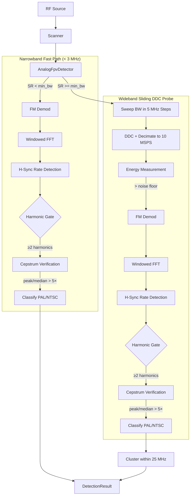

# Design: FPV Analog Drone Detection (orecchiette-fpv-drone-analog-rs)

This document outlines the architectural and mathematical design of the `orecchiette-fpv-drone-analog-rs` crate, a high-confidence detection system for analog FPV drone video signals.

## 1. Introduction
Detecting analog FPV (First Person View) drones requires distinguishing a wideband FM video signal (typically 10-20 MHz wide) from common interference like Wi-Fi (20/40 MHz) and narrowband noise. This crate employs a **sliding DDC probe** pipeline that sweeps across the capture bandwidth, FM-demodulates at each position, and searches for characteristic video sync line rates.

## 2. System Architecture

The system is designed to be hardware-agnostic, interacting with RF frontends through abstracted I/Q data buffers.

## 3. Detection Logic

### Narrowband Fast Path
When `sample_rate < min_bandwidth` (default 3 MHz), the signal is assumed to already be isolated at baseband. The detector runs FM demodulation and sync pulse detection directly.

### Wideband Sliding DDC Probe
For wideband captures (e.g., 100 MSPS), the detector sweeps the entire capture bandwidth:

1. **Probe Grid**: The bandwidth is divided into 5 MHz steps with a 5 MHz margin at each edge. For 100 MSPS, this yields ~18 probe positions.

2. **DDC + Decimation**: At each probe position, a Digital Down-Converter (NCO mixer) shifts the probe frequency to DC, then a boxcar low-pass filter decimates to 10 MSPS. This isolates a ~10 MHz slice around each probe center.

3. **Energy Gating**: Mean power is computed at each probe position. The **25th percentile** of all probe energies is used as a robust noise floor estimate (resistant to FM signals covering large fractions of the bandwidth). Probes with energy exceeding the noise floor by `energy_threshold_db` (default 3.0 dB, linear multiplier: $10^{\text{energy\_threshold\_db} / 10.0}$) proceed to sync validation.

Additionally, all finalized detection events are filtered to only return results whose bandwidth falls within the `min_bandwidth` and `max_bandwidth` thresholds.

4. **FM Demodulation**: The isolated I/Q is FM-demodulated via the differentiate-and-multiply discriminator: `arg(z[n] × conj(z[n-1]))`. This recovers the baseband video signal where sync pulses are encoded as instantaneous frequency excursions.

5. **Sync Pulse Detection**: A Hann-windowed FFT of the demodulated signal searches for spectral peaks at the H-sync line rates:
   - **PAL**: 15,625 Hz (bin = `round(15625 / bin_hz)`)
   - **NTSC**: 15,734 Hz (bin = `round(15734 / bin_hz)`)

   When FFT resolution is sufficient to resolve both rates into distinct bins (bin_hz < 109 Hz, requiring > 9.2 ms of data), the detector classifies PAL vs NTSC directly from the spectrum. When the bins collide (e.g. a 2.6 ms chunk at 25 MSPS gives ≈ 381 Hz/bin), the detector falls back to a **time-domain median sync-tip interval** measured on the FM-demodulated record (`classify_pal_ntsc_time_domain`): the median line period maps to a line rate that's compared against PAL (15625 Hz) and NTSC (15734 Hz), with a ±30 Hz dead-band around the midpoint. Only if that fallback is also inconclusive (too few sync tips, or the median lands in the dead-band) does the burst get tagged `AnalogVideoUnknown` rather than committing to a standard. Callers gate on `SignalType::is_analog_video()` when they want the "is this an analog FPV signal at all?" answer without committing to a PAL/NTSC label.

6. **Harmonic-Consistency Check**: H-sync is a ~7 % duty-cycle rectangular pulse train; its FM-demodulated spectrum has the fundamental at the line rate plus a rich harmonic series (sinc-envelope coefficients keep the first ~14 harmonics within roughly −3 dB of the fundamental). A CW interferer or narrowband-FM tone that happens to land in the line-rate bin produces a fundamental ONLY. The detector counts how many of the first 5 harmonics exceed 10 % of the fundamental amplitude — at least 2 are required for a positive classification. Threshold is fundamental-relative (not noise-floor-relative) because spectral leakage from the strong fundamental otherwise drags the noise floor estimate down enough that any FFT-window sidelobe at 2× the fundamental crosses a noise-floor-relative threshold.

7. **Cepstrum Structural Verification (`verify_cepstrum`)**: After the harmonic gate passes, the detector runs a cepstral analysis on the FFT buffer to confirm the harmonics arise from a true periodic pulse train rather than a coincidental arrangement of narrowband interferers. The cepstrum — computed as `IFFT(ln|FFT[k]|²)` — collapses a harmonic comb into a single sharp peak at the quefrency corresponding to the pulse period (`sample_rate / line_rate_hz`). The detector:
   - Computes the power spectrum `|FFT[k]|²` (branchless multiply loop, SIMD-friendly).
   - Takes the log: `ln(power + ε)` where `ε = 1e-12` prevents log(0).
   - Applies IFFT via `rustfft` (platform SIMD).
   - Searches ±2% around the expected quefrency for the peak.
   - Computes peak/median ratio — a threshold of ≥ 5× is required.
   
   A real pulse train produces a peak/median ratio of 20–100×; multi-CW tones with non-harmonic spacing or broadband noise produce ratios < 3×. This gate closes the false-positive gap the harmonic check alone cannot cover: interferers whose tones happen to land in harmonic bins of the line rate.

8. **Clustering**: All positive detections are sorted by frequency and clustered within a 25 MHz radius. This radius matches the spectral footprint of an analog FPV transmission — while the baseband composite video is ~5 MHz wide, the wideband FM modulation (typically ±15–17 MHz deviation) produces a total occupied RF bandwidth of ~20–30 MHz. The probe with the strongest energy in each cluster is kept as the representative, collapsing adjacent-channel bleed-over into a single detection.

### Why FM Demodulation?
Previous iterations used **magnitude envelope** analysis (`|I + jQ|`), which works for AM signals but fails for FM video — FM is a constant-envelope modulation where sync pulses modulate the *instantaneous frequency*, not the amplitude. The FM demod approach correctly recovers the baseband video waveform where H-sync pulses produce clean spectral peaks.

## 4. Confidence Scoring Model

| Score | SignalType | Meaning |
| :--- | :--- | :--- |
| **0.0** | `Unknown` | No sync rate detected, or harmonic-consistency check failed |
| **0.6** | `AnalogVideoUnknown` | H-sync detected, harmonic check passed, but FFT bins for PAL/NTSC collided **and** the time-domain median-interval fallback was inconclusive (too few sync tips, or median in the ±30 Hz midpoint dead-band) |
| **0.6** | `AnalogVideoPal` / `AnalogVideoNtsc` | Demoted from 0.8/0.95 by an *opt-in* check (`demote_unconfirmed_video`, default off) — a harmonic-comb match spanning ≥ 2.5 field periods with **zero** confirmed vertical-sync groups (§7) |
| **0.75** | `AnalogVideoUnknown` | The 0.6 case above, but §7's VBI confirm stage found genuine periodic field-sync structure underneath — definitely analog video, just not tagged PAL vs NTSC |
| **0.8** | `AnalogVideoPal` / `AnalogVideoNtsc` | Distinct H-sync bin AND ≥ 2 harmonics above the threshold (high-confidence pulse-train classification), **or** colliding bins disambiguated by the time-domain median sync-tip interval |
| **0.95** | `AnalogVideoPal` / `AnalogVideoNtsc` | The 0.8 case above, additionally confirmed by §7's VBI parser: either ≥ 2 field-period-spaced vertical-sync groups, or 1 group on a slice too short to possibly contain a second |

Harmonic structure is treated as a *gate*, not a confidence input — a candidate that lacks ≥ 2 harmonics is rejected (returns `Unknown`) regardless of fundamental energy. This is symmetric across the bins-distinct and bin-collision branches: both require the harmonic check to pass before claiming any video classification. CW tones and narrowband-FM interferers that happen to land in the H-sync bin therefore reject cleanly.

`SignalType::is_analog_video()` returns `true` for any of the three video variants, including `AnalogVideoUnknown`. Callers that need a strict PAL/NTSC tag should match on the specific variant; callers that only care "is analog FPV present?" should use the helper.

The harmonic-comb + cepstrum checks (items 6–7 above) only ever see one FFT's worth of a single slice — they confirm the *line rate* is present, not that it belongs to a real interlaced field. §7 adds that second, independent confirmation.

## 5. Hardware Requirements & Scan Configuration

- **Sample Rate**: Minimum 1 MSPS for sync pulse detection at baseband. ≥ 20 MSPS recommended for wideband scanning. The B210 over USB 3.0 runs clean at 25 MSPS; at 50 MSPS the USB transport saturates (~400 MB/s), producing intermittent hardware FIFO overflows. 25 MSPS is the recommended maximum for the B210.
- **Packet Size**: 262,144 samples per packet (at 100 MSPS = 2.6 ms). Larger packets improve PAL/NTSC discrimination.
- **Bands**: 1.2 GHz, 3.3 GHz, 5.3–5.9 GHz, and 6–7 GHz support is built-in via `bands.rs` channel tables (used for display/labeling, not detection).
- **Scan Dwell**: 10 ms per hop in the auto-scanner — sized for USRP PLL settle (~2 ms) + one full 65536-sample chunk (~2.6 ms at 25 MSPS). The detector only needs a single chunk per hop. All remaining duplicate-frequency packets are skipped to prevent queue buildup.
- **Scan Modes** (via `fpv_viewer --scan-mode`):
  - `58` (default): 5.8 GHz FPV band only (5.645–5.945 GHz). ~16 hops at 25 MSPS, ~160 ms per sweep.
  - `ua` (Ukraine): covers 1.2 GHz (1080–1360 MHz), 3.3 GHz (2870–4080 MHz), 5.3–5.9 GHz (5300–5945 MHz), and 6–7 GHz (6100–7300 MHz). ~100+ hops, ~1–2 s per sweep. Modelled after the Chuyka 3.0 detector and PEAK THOR T67 VTX evasion band used in the Ukraine theatre (2024–2025).

## 6. Known Follow-ups & Historical Notes

1. The wideband sweep's `ddc_and_decimate` used to be a length-N boxcar
   (`sum/N`) low-pass. Its sinc magnitude response has poor stopband
   attenuation, so under the FM threshold effect, adjacent-band energy
   leaked through and synthesised spurious harmonic content in the
   discriminator output. Replaced with a proper 63-tap Blackman-
   windowed-sinc FIR (> 50 dB stopband) — closes that gap at the cost
   of one extra allocation per probe. A polyphase decimating FIR would
   avoid computing FIR output for samples the decimation stride
   discards anyway (~5× per-probe speedup); not yet done.
2. §7's sweep decimation must track the *actual* rate a probe was
   decimated to, not assume it always lands on the nominal
   `WIDEBAND_TARGET_RATE_HZ` — integer division of `sample_rate /
   target_rate` only produces an exact rate when `sample_rate` is a
   clean multiple of `target_rate` (e.g. 50 or 100 MSPS). A capture at
   25 MSPS truncates the factor from 2.5 to 2, giving 12.5 MHz actual
   output; passing the wrong assumed rate into `detect_sync_pulses`
   silently corrupts every frequency-derived computation in there.
   Fixed by computing the decimated rate the same way the DDC itself
   does (`decimated_rate`/`decimation_factor` helpers), rather than a
   separate, driftable assumption.

## 7. Vertical Blanking Interval (VBI) Parsing

The confidence tiers in §4 above depend on genuinely confirming
periodic *field*-sync structure, not just a plausible line-rate comb —
a strong, spectrally broad, non-video interferer (cellular OFDM
symbol/frame timing is the classic case) can produce harmonics and
even a convincing cepstral peak without being real analog video.
`vbi.rs` parses the actual vertical-sync pulse train to close that gap,
and the same parser also drives the reconstructor's field-accurate
sync lock (§9).

### Pulse classification

Real analog video vertical sync is a standardised sequence of pulses,
all leading on the same half-line grid but differing in width:

| Family | Width | Role |
| :--- | :--- | :--- |
| Equalizing | 2.3 µs (NTSC) / 2.35 µs (PAL) | Pre/post-vsync, keeps the H oscillator locked through the transition |
| Horizontal | 4.7 µs | Ordinary line sync, in blanking or active-video lines |
| Broad (serrated) | 27.1 µs (NTSC) / 27.3 µs (PAL) low, briefly high mid-pulse | The vertical-sync pulse itself; NTSC uses 6, PAL uses 5 |

`extract_pulses` slices the demodulated signal at the midpoint between
`levels::estimate_sync_levels`'s measured sync-tip and blanking levels
(brightness/DC-invariant, matching `robust_sync_tip_center`'s
rationale elsewhere in the crate), then classifies each below-
threshold run purely by width. Because the three widths differ by
more than 2× at every boundary, a single click of FM noise can't flip
a run from one family to another the way an edge-triggered decision
could.

**Spacing math uses pulse *start* (leading edge), never *center*.**
Different families have different widths, so comparing centers across
a family boundary (an equalizing pulse next to a broad pulse, say)
introduces a spurious offset of roughly half that width difference —
large enough to make the very next pulse in a scan miss entirely. Only
the leading edge is common across all three families.

### Broad-group detection and field parity

`find_broad_groups` scans for runs of ≥ 4 consecutive broad pulses
spaced at half a line period (±15%) — the standard specifies 6 (NTSC)
/ 5 (PAL); requiring only 4 tolerates a couple of corrupted pulses
without losing lock. `find_vertical_sync` takes the first such group;
`confirm_field_sync` (used by the detector) takes *all* of them and
checks that consecutive groups land a full field period apart —
essentially unfakeable by a non-video interferer, since it demands two
independent field-length-separated confirmations, not just one.

Field parity — which of the two interlaced fields a slice belongs to
— is *not* recovered by fitting a phase against an independently-
indexed local grid. That was the first approach tried, and it doesn't
work: this crate's own synthetic generator (and, per the underlying
broadcast standards, real video) places the plain-blanking H-sync
pulses immediately after the vertical-sync group at the *same* fixed
cadence relative to `broad_start`, regardless of parity — only *where
active video starts* relative to that cadence differs by half a line.
So instead, the parser computes both standards' predicted active-video
start (a calibrated line count from `broad_start`, or that plus half a
line) and checks *which one* an actual H-sync pulse confirms — a
direct hypothesis test against the real pulse train, not a phase fit.

### Standards-correct blanking

The exact line at which active video begins is a genuinely
convention-dependent number in real broadcast practice (sources cite
anywhere from line 20 to 22 for NTSC). Rather than encode one such
number and risk a half-line mismatch against whatever the parser
derives independently, the crate defines its own self-consistent
convention (`vbi::consts::{NTSC,PAL}_BASE_ACTIVE_START_LINES`): the
synthetic generator (`synthetic.rs`) lays fields out against it, and
the parser's active-video datum is calibrated against the generator
(proven by the reconstructor's row-geometry tests), not re-derived
from a spec table. Internal consistency between generator, parser, and
reconstructor is what actually matters here — it replaced a single
hardcoded 20-line blanking skip that was simply wrong for PAL (which
needs 25).

## 8. FM Deviation Auto-Estimation

Both the reconstructor's sync/AGC thresholds and the live-video
decoder's DDC bandwidth depend on knowing the transmitter's true FM
peak deviation. A fixed assumption is fragile in both directions: too
high, and the vsync threshold (`-0.3 · 2π·dev/fs`) becomes deeper than
any real sync tip ever reaches, so lock never happens at all; too low,
and the DDC cutoff clips the signal's real sidebands.

`levels::estimate_fm_deviation` measures it directly from the
demodulated waveform, deliberately without requiring sync lock first —
the reconstructor's own vsync threshold is *derived from* the assumed
deviation, so an estimator that itself needed a lock would be
circular.

1. Smooth with a ~0.5 µs moving average to suppress FM click noise.
2. Take the 2nd and 50th percentile of the smoothed signal (via a
   decimated copy) as robust, brightness-invariant stand-ins for "pure
   sync tip" and "typical mid-signal level."
3. Threshold at `p2 + 0.25·(p50 − p2)` and scan for below-threshold
   runs 1.5–32 µs wide — covers everything from equalizing pulses
   through serrated broad pulses, rejecting clicks and long dropouts.
4. For each surviving run, take the median of its interior samples as
   the tip level, and the median of a +1.0…+3.0 µs window after it as
   the porch/blanking level — that window lands on blanking level for
   every pulse family, including the brief serration after a broad
   pulse.
5. Take the median swing (porch − tip) across all pulses, with a
   3×MAD outlier gate, then require the population to be clearly
   bimodal (swing > 20×MAD) before trusting it. A flat or noisy signal
   produces a small, noisy swing that this rejects.
6. Convert via `deviation_hz = swing · fs / (2π · SYNC_TO_BLANK_FRACTION)`.

`SYNC_TO_BLANK_FRACTION = 0.4` is not an independent tuning constant —
it's the same fraction already implicit in the reconstructor's AGC
(which scales active video assuming a `0.4 · radians_per_volt`
sync-to-blank swing) and its vsync threshold (`-0.3 · radians_per_volt`,
inside that same swing). Using the identical constant here means a
deviation estimate derived from a measured swing is self-consistent
with every other threshold in the crate by construction: once
`FrameReconstructor::set_fm_deviation(estimate)` is applied, sync tips
land at exactly `-SYNC_TO_BLANK_FRACTION · radians_per_volt`, no
further tuning required.

The estimate needs ~5 ms of data in principle (comfortably above the
≥ 50-pulse floor the bimodality gate requires), though callers
typically give it more for stability — orecchiette's live decoder
waits for ~60 ms before the first attempt, then re-checks periodically
and re-locks only on a persistent (median-of-3) drift, so a single
noisy estimate can't trigger a DDC rebuild mid-stream.

## 9. Frame Reconstruction & Live Playback

`video::FrameReconstructor` turns a demodulated signal into displayable
frames: a sub-sample Time Base Corrector (TBC), §7's VBI parser for
field-accurate sync lock (falling back to a density heuristic when the
parser can't lock — real VBI is dirtier than the spec on cheap FPV
cameras and deep fades), a subcarrier notch for dot-crawl suppression,
multi-field temporal denoise + dropout repair, Dropout Compensation
(DOC), and a luma transient-improvement (unsharp) pass.

**Output is monochrome (luma only).** Analog FPV video's color
subcarrier carries relatively little of the information an operator
actually needs (target identification, terrain, orientation), color
decode requires burst-phase recovery that's a substantial additional
pipeline on its own, and low-SNR RF links tend to look *better* in
clean grayscale than in noisy, decoded color. The color subcarrier
notch is repurposed instead to eliminate dot-crawl artifacts from the
pure luma signal.

**Deemphasis is deliberately not a `FrameReconstructor` method.** Live
decoding calls `reconstruct_frame_into` repeatedly on the *unconsumed
tail* of a persistent demod buffer — each call re-reads samples the
previous call already saw, advancing a cursor by however much it
consumed. A stateful filter living inside the reconstructor would
re-filter already-filtered samples on every call. `demod::Deemphasis`
is instead applied exactly once, stream-side, immediately after
`demod::fm_demod` and before samples ever enter that persistent
buffer.
