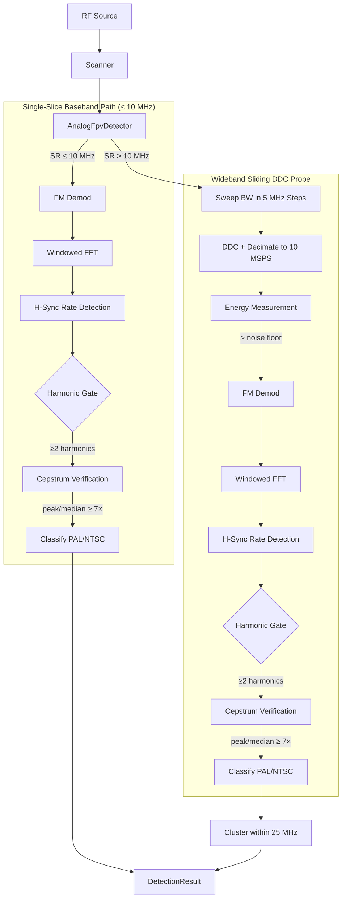

# Design: FPV Analog Drone Detection (orecchiette-fpv-drone-analog-rs)

This document outlines the architectural and mathematical design of the `orecchiette-fpv-drone-analog-rs` crate, a high-confidence detection system for analog FPV drone video signals.

## 1. Introduction
Detecting analog FPV (First Person View) drones requires distinguishing a wideband FM video signal (typically 10-20 MHz wide) from common interference like Wi-Fi (20/40 MHz) and narrowband noise. This crate employs a **sliding DDC probe** pipeline that sweeps across the capture bandwidth, FM-demodulates at each position, and searches for characteristic video sync line rates.

## 2. System Architecture

The system is designed to be hardware-agnostic, interacting with RF frontends through abstracted I/Q data buffers.

```mermaid
graph TD
    A[RF Source] --> B[Scanner]
    B --> C[AnalogFpvDetector]
    
    subgraph "Single-Slice Baseband Path (≤ 10 MHz)"
        C -->|"SR ≤ 10 MHz"| D1[FM Demod]
        D1 --> D2[Windowed FFT]
        D2 --> D3[H-Sync Rate Detection]
        D3 --> D4{Harmonic Gate}
        D4 -->|"≥2 harmonics"| D5[Cepstrum Verification]
        D5 -->|"peak/median ≥ 7×"| D6[Classify PAL/NTSC]
    end
    
    subgraph "Wideband Sliding DDC Probe"
        C -->|"SR > 10 MHz"| E1[Sweep BW in 5 MHz Steps]
        E1 --> E2[DDC + Decimate to 10 MSPS]
        E2 --> E3[Energy Measurement]
        E3 -->|"> noise floor"| E4[FM Demod]
        E4 --> E5[Windowed FFT]
        E5 --> E6[H-Sync Rate Detection]
        E6 --> E7{Harmonic Gate}
        E7 -->|"≥2 harmonics"| E8[Cepstrum Verification]
        E8 -->|"peak/median ≥ 7×"| E9[Classify PAL/NTSC]
    end
    
    E9 --> F[Cluster within 25 MHz]
    D6 --> G[DetectionResult]
    F --> G
```

## 3. Detection Logic

### Single-Slice Baseband Path
When `sample_rate <= WIDEBAND_TARGET_RATE_HZ` (10 MHz), the signal is assumed to already be isolated at baseband and the detector runs FM demodulation and sync pulse detection directly — the sweep's 5 MHz step + 5 MHz edge margin can't form a meaningful probe grid below that rate. Captures between ~10 and ~25 MSPS (fewer than 4 probe positions, too few for the percentile noise floor) are likewise classified as one baseband slice at the tuned centre; a video signal is ~20 MHz wide and spans the whole capture at those rates anyway.

### Wideband Sliding DDC Probe
For wideband captures (e.g., 100 MSPS), the detector sweeps the entire capture bandwidth:

1. **Probe Grid**: The bandwidth is divided into 5 MHz steps with a 5 MHz margin at each edge. For 100 MSPS, this yields ~18 probe positions.

2. **DDC + Decimation**: At each probe position, a Digital Down-Converter (NCO mixer) shifts the probe frequency to DC, then a 63-tap Blackman-windowed-sinc FIR (> 50 dB stopband, cutoff `target_rate / 3`; see §6 item 1 for the boxcar it replaced) band-limits before integer-stride decimation to 10 MSPS. This isolates a slice around each probe center.

3. **Energy Gating**: Mean power is computed at each probe position. The **25th percentile** of all probe energies is used as a robust noise floor estimate (resistant to FM signals covering large fractions of the bandwidth). Probes with energy exceeding the noise floor by `energy_threshold_db` (default 3.0 dB, linear multiplier: $10^{\text{energy\_threshold\_db} / 10.0}$) proceed to sync validation. In *integrated* mode (`detect_from_iq_integrated`, §11) the gate no longer skips classification — every probe is demodulated and accumulated, because a signal below one batch's energy floor is exactly the one integration exists to find.

Additionally, all finalized detection events are filtered to only return results whose bandwidth falls within the `min_bandwidth` and `max_bandwidth` thresholds (defaults: 1 MHz and 30 MHz) and whose confidence clears `min_confidence` (default 0.7).

4. **FM Demodulation**: The isolated I/Q is FM-demodulated via the differentiate-and-multiply discriminator: `arg(z[n] × conj(z[n-1]))`. This recovers the baseband video signal where sync pulses are encoded as instantaneous frequency excursions.

5. **Sync Pulse Detection**: A Hann-windowed FFT of the demodulated signal searches for spectral peaks at the H-sync line rates:
   - **PAL**: 15,625 Hz (bin = `round(15625 / bin_hz)`)
   - **NTSC**: 15,734 Hz (bin = `round(15734 / bin_hz)`)

   The transform is zero-padded to the next power of two. This is purely a speed measure: `fm_demod` returns `n - 1` samples, so a 65536-sample capture block would otherwise transform at 65535 points — and 65535 = 3·5·17·257, whose 257 factor drops `rustfft` onto Rader's algorithm at roughly 6× the cost of the 65536-point radix-4 path (1009 µs vs 168 µs measured). Padding buys that back for one zero sample.

   Padding **interpolates** the spectrum onto a finer bin grid; it adds no information and does not improve true (Rayleigh) resolution, which stays `sample_rate / record_len`. Every resolution-dependent decision is therefore pinned to the unpadded record length rather than the padded FFT length: the PAL/NTSC bin-collision test below, the peak-search window (scaled up in padded bins so it spans the same absolute Hz), and the cepstrum's quefrency range. Deciding those on the padded grid would let the detector claim a PAL/NTSC separation the data cannot support.

   When resolution is sufficient to resolve both rates into distinct bins (bin_hz < 109 Hz, requiring > 9.2 ms of data), the detector classifies PAL vs NTSC directly from the spectrum. When the bins collide (e.g. a 2.6 ms chunk at 25 MSPS gives ≈ 381 Hz/bin), the detector falls back to a **time-domain median sync-tip interval** measured on the FM-demodulated record (`classify_pal_ntsc_time_domain`): the median line period maps to a line rate that's compared against PAL (15625 Hz) and NTSC (15734 Hz), with a ±30 Hz dead-band around the midpoint. Only if that fallback is also inconclusive (too few sync tips, or the median lands in the dead-band) does the burst get tagged `AnalogVideoUnknown` rather than committing to a standard. Callers gate on `SignalType::is_analog_video()` when they want the "is this an analog FPV signal at all?" answer without committing to a PAL/NTSC label.

6. **Harmonic-Consistency Check**: H-sync is a ~7 % duty-cycle rectangular pulse train; its FM-demodulated spectrum has the fundamental at the line rate plus a rich harmonic series (sinc-envelope coefficients keep the first ~14 harmonics within roughly −3 dB of the fundamental). A CW interferer or narrowband-FM tone that happens to land in the line-rate bin produces a fundamental ONLY. The detector counts how many of the first 5 harmonics exceed 10 % of the fundamental amplitude — at least 2 are required for a positive classification. Threshold is fundamental-relative (not noise-floor-relative) because spectral leakage from the strong fundamental otherwise drags the noise floor estimate down enough that any FFT-window sidelobe at 2× the fundamental crosses a noise-floor-relative threshold. The absolute floor these checks reference is the **median** of the in-band magnitude bins, not the mean — the range includes the signal's own spectrum, and a mean let a real signal raise its own detection floor, costing sensitivity exactly on weak signals.

6a. **Time-domain thresholds**: `classify_pal_ntsc_time_domain` (and `video::detect_video_standard`) threshold sync tips at `p2 + 0.25·(p50 − p2)` of a ~0.5 µs-smoothed record — the same robust construction `levels::estimate_fm_deviation` uses. The `global_min · 0.3` threshold they previously used latched onto single FM-click outliers (which are bounded at ±π but far deeper than a weak signal's sync tips), putting the threshold beneath every real tip at exactly the low CNR these classifiers exist for; percentiles are also DC-invariant, so a tuning-offset demod no longer breaks classification.

7. **Cepstrum Structural Verification (`verify_cepstrum`)**: After the harmonic gate passes, the detector runs a cepstral analysis on the FFT buffer to confirm the harmonics arise from a true periodic pulse train rather than a coincidental arrangement of narrowband interferers. The cepstrum — computed as `IFFT(ln|FFT[k]|²)` — collapses a harmonic comb into a single sharp peak at the quefrency corresponding to the pulse period (`sample_rate / line_rate_hz`). The detector:
   - Computes the power spectrum `|FFT[k]|²` (branchless multiply loop, SIMD-friendly).
   - Takes the log: `ln(power + ε)` where `ε = 1e-12` prevents log(0).
   - Applies IFFT via `rustfft` (platform SIMD).
   - Searches ±2% around the expected quefrency for the peak.
   - Computes peak/median ratio — a threshold of ≥ 7× (`CEPSTRAL_RATIO_THRESHOLD`) is required.
   
   A real pulse train produces a peak/median ratio of roughly 5–20×; multi-CW tones with non-harmonic spacing or broadband noise produce ratios < 3×. The threshold sits *inside* the real-signal range rather than at its bottom: the ~5× region is also where a strong, spectrally broad, genuinely periodic non-video interferer (cellular OFDM symbol/frame timing is the classic case) can land, so a little sensitivity on very weak signals is traded for rejecting that class of false positive. This gate closes the gap the harmonic check alone cannot cover: interferers whose tones happen to land in harmonic bins of the line rate.

8. **Clustering**: All positive detections are sorted by frequency and clustered within a 25 MHz radius. This radius matches the spectral footprint of an analog FPV transmission — while the baseband composite video is ~5 MHz wide, the wideband FM modulation (typically ±15–17 MHz deviation) produces a total occupied RF bandwidth of ~20–30 MHz. The probe with the strongest energy in each cluster is kept as the representative, collapsing adjacent-channel bleed-over into a single detection.

### Why FM Demodulation?
Previous iterations used **magnitude envelope** analysis (`|I + jQ|`), which works for AM signals but fails for FM video — FM is a constant-envelope modulation where sync pulses modulate the *instantaneous frequency*, not the amplitude. The FM demod approach correctly recovers the baseband video waveform where H-sync pulses produce clean spectral peaks.

## 4. Confidence Scoring Model

| Score | SignalType | Meaning |
| :--- | :--- | :--- |
| **0.0** | `Unknown` | No sync rate detected, or harmonic-consistency check failed |
| **0.6** | `AnalogVideoUnknown` | H-sync detected, harmonic check passed, but FFT bins for PAL/NTSC collided **and** the time-domain median-interval fallback was inconclusive (too few sync tips, or median in the ±30 Hz midpoint dead-band) |
| **0.6** | `AnalogVideoPal` / `AnalogVideoNtsc` | Demoted from 0.8/0.95 by an *opt-in* check (`demote_unconfirmed_video`, default off) — a harmonic-comb match spanning ≥ 2.5 field periods with **zero** confirmed vertical-sync groups (§7) |
| **0.75** | `AnalogVideoUnknown` | The 0.6 case above, but §7's VBI confirm stage found genuine periodic field-sync structure underneath — definitely analog video, just not tagged PAL vs NTSC |
| **0.8** | `AnalogVideoPal` / `AnalogVideoNtsc` | Distinct H-sync bin AND ≥ 2 harmonics above the threshold (high-confidence pulse-train classification), **or** colliding bins disambiguated by the time-domain median sync-tip interval |
| **0.95** | `AnalogVideoPal` / `AnalogVideoNtsc` | The 0.8 case above, additionally confirmed by §7's VBI parser: either ≥ 2 field-period-spaced vertical-sync groups, or 1 group on a slice too short to possibly contain a second |

Harmonic structure is treated as a *gate*, not a confidence input — a candidate that lacks ≥ 2 harmonics is rejected (returns `Unknown`) regardless of fundamental energy. This is symmetric across the bins-distinct and bin-collision branches: both require the harmonic check to pass before claiming any video classification. CW tones and narrowband-FM interferers that happen to land in the H-sync bin therefore reject cleanly.

`SignalType::is_analog_video()` returns `true` for any of the three video variants, including `AnalogVideoUnknown`. Callers that need a strict PAL/NTSC tag should match on the specific variant; callers that only care "is analog FPV present?" should use the helper.

The harmonic-comb + cepstrum checks (items 6–7 above) only ever see one FFT's worth of a single slice — they confirm the *line rate* is present, not that it belongs to a real interlaced field. §7 adds that second, independent confirmation.

## 5. Hardware Requirements & Scan Configuration

- **Sample Rate**: Minimum 1 MSPS for sync pulse detection at baseband. ≥ 20 MSPS recommended for wideband scanning. The B210 over USB 3.0 runs clean at 25 MSPS; at 50 MSPS the USB transport saturates (~400 MB/s), producing intermittent hardware FIFO overflows. 25 MSPS is the recommended maximum for the B210.
- **Packet Size**: 262,144 samples per packet (at 100 MSPS = 2.6 ms). Larger packets improve PAL/NTSC discrimination.
- **Bands**: `bands.rs` carries channel tables (used for display/labeling and `--channel` resolution, not detection) for 1.2 GHz, 3.3 GHz, and the 5.3–5.9 GHz bands — A/B/E/F/R plus Lowband L (5333 + 40 MHz grid) and Boscam D (5362 + 37 MHz grid).
- **Scan Dwell**: 10 ms per hop in the auto-scanner, which sweeps the 5.8 GHz FPV band (5.645–5.945 GHz; ~16 hops at 25 MSPS, ~160 ms per sweep) — sized for USRP PLL settle (~2 ms) + one full 65536-sample chunk (~2.6 ms at 25 MSPS). The detector only needs a single chunk per hop. All remaining duplicate-frequency packets are skipped to prevent queue buildup.

## 6. Known Follow-ups & Historical Notes

1. The wideband sweep's `ddc_and_decimate` used to be a length-N boxcar
   (`sum/N`) low-pass. Its sinc magnitude response has poor stopband
   attenuation, so under the FM threshold effect, adjacent-band energy
   leaked through and synthesised spurious harmonic content in the
   discriminator output. Replaced with a proper 63-tap Blackman-
   windowed-sinc FIR (> 50 dB stopband) — closes that gap at the cost
   of one extra allocation per probe. A polyphase decimating FIR would
   avoid computing FIR output for samples the decimation stride
   discards anyway (~5× per-probe speedup); not yet done.
2. §7's sweep decimation must track the *actual* rate a probe was
   decimated to, not assume it always lands on the nominal
   `WIDEBAND_TARGET_RATE_HZ` — integer division of `sample_rate /
   target_rate` only produces an exact rate when `sample_rate` is a
   clean multiple of `target_rate` (e.g. 50 or 100 MSPS). A capture at
   25 MSPS truncates the factor from 2.5 to 2, giving 12.5 MHz actual
   output; passing the wrong assumed rate into `detect_sync_pulses`
   silently corrupts every frequency-derived computation in there.
   Fixed by computing the decimated rate the same way the DDC itself
   does (`decimated_rate`/`decimation_factor` helpers), rather than a
   separate, driftable assumption.

## 7. Vertical Blanking Interval (VBI) Parsing

The confidence tiers in §4 above depend on genuinely confirming
periodic *field*-sync structure, not just a plausible line-rate comb —
a strong, spectrally broad, non-video interferer (cellular OFDM
symbol/frame timing is the classic case) can produce harmonics and
even a convincing cepstral peak without being real analog video.
`vbi.rs` parses the actual vertical-sync pulse train to close that gap,
and the same parser also drives the reconstructor's field-accurate
sync lock (§9).

### Pulse classification

Real analog video vertical sync is a standardised sequence of pulses,
all leading on the same half-line grid but differing in width:

| Family | Width | Role |
| :--- | :--- | :--- |
| Equalizing | 2.3 µs (NTSC) / 2.35 µs (PAL) | Pre/post-vsync, keeps the H oscillator locked through the transition |
| Horizontal | 4.7 µs | Ordinary line sync, in blanking or active-video lines |
| Broad (serrated) | 27.1 µs (NTSC) / 27.3 µs (PAL) low, briefly high mid-pulse | The vertical-sync pulse itself; NTSC uses 6, PAL uses 5 |

`extract_pulses` slices the demodulated signal at the midpoint between
`levels::estimate_sync_levels`'s measured sync-tip and blanking levels
(brightness/DC-invariant, matching `robust_sync_tip_center`'s
rationale elsewhere in the crate), then classifies each below-
threshold run purely by width. Because the three widths differ by
more than 2× at every boundary, a single click of FM noise can't flip
a run from one family to another the way an edge-triggered decision
could.

**Spacing math uses pulse *start* (leading edge), never *center*.**
Different families have different widths, so comparing centers across
a family boundary (an equalizing pulse next to a broad pulse, say)
introduces a spurious offset of roughly half that width difference —
large enough to make the very next pulse in a scan miss entirely. Only
the leading edge is common across all three families.

### Broad-group detection and field parity

`find_broad_groups` scans for runs of ≥ 4 consecutive broad pulses
spaced at half a line period (±15%) — the standard specifies 6 (NTSC)
/ 5 (PAL); requiring only 4 tolerates a couple of corrupted pulses
without losing lock. `find_vertical_sync` takes the first such group;
`confirm_field_sync` (used by the detector) takes *all* of them and
checks that consecutive groups land a full field period apart —
essentially unfakeable by a non-video interferer, since it demands two
independent field-length-separated confirmations, not just one.

Field parity — which of the two interlaced fields a slice belongs to
— is *not* recovered by fitting a phase against an independently-
indexed local grid. That was the first approach tried, and it doesn't
work: this crate's own synthetic generator (and, per the underlying
broadcast standards, real video) places the plain-blanking H-sync
pulses immediately after the vertical-sync group at the *same* fixed
cadence relative to `broad_start`, regardless of parity — only *where
active video starts* relative to that cadence differs by half a line.
So instead, the parser computes both standards' predicted active-video
start (a calibrated line count from `broad_start`, or that plus half a
line) and checks *which one* an actual H-sync pulse confirms — a
direct hypothesis test against the real pulse train, not a phase fit.

### Standards-correct blanking

The exact line at which active video begins is a genuinely
convention-dependent number in real broadcast practice (sources cite
anywhere from line 20 to 22 for NTSC). Rather than encode one such
number and risk a half-line mismatch against whatever the parser
derives independently, the crate defines its own self-consistent
convention (`vbi::consts::{NTSC,PAL}_BASE_ACTIVE_START_LINES`): the
synthetic generator (`synthetic.rs`) lays fields out against it, and
the parser's active-video datum is calibrated against the generator
(proven by the reconstructor's row-geometry tests), not re-derived
from a spec table. Internal consistency between generator, parser, and
reconstructor is what actually matters here — it replaced a single
hardcoded 20-line blanking skip that was simply wrong for PAL (which
needs 25).

## 8. FM Deviation Auto-Estimation

Both the reconstructor's sync/AGC thresholds and the live-video
decoder's DDC bandwidth depend on knowing the transmitter's true FM
peak deviation. A fixed assumption is fragile in both directions: too
high, and the vsync threshold (`-0.3 · 2π·dev/fs`) becomes deeper than
any real sync tip ever reaches, so lock never happens at all; too low,
and the DDC cutoff clips the signal's real sidebands.

`levels::estimate_fm_deviation` measures it directly from the
demodulated waveform, deliberately without requiring sync lock first —
the reconstructor's own vsync threshold is *derived from* the assumed
deviation, so an estimator that itself needed a lock would be
circular.

1. Smooth with a ~0.5 µs moving average to suppress FM click noise.
2. Take the 2nd and 50th percentile of the smoothed signal (via a
   decimated copy) as robust, brightness-invariant stand-ins for "pure
   sync tip" and "typical mid-signal level."
3. Threshold at `p2 + 0.25·(p50 − p2)` and scan for below-threshold
   runs 1.5–32 µs wide — covers everything from equalizing pulses
   through serrated broad pulses, rejecting clicks and long dropouts.
4. For each surviving run, take the median of its interior samples as
   the tip level, and the median of a +1.0…+3.0 µs window after it as
   the porch/blanking level — that window lands on blanking level for
   every pulse family, including the brief serration after a broad
   pulse.
5. Take the median swing (porch − tip) across all pulses, with a
   3×MAD outlier gate, then require the population to be clearly
   bimodal (swing > 20×MAD) before trusting it. A flat or noisy signal
   produces a small, noisy swing that this rejects.
6. Convert via `deviation_hz = swing · fs / (2π · SYNC_TO_BLANK_FRACTION)`.

`SYNC_TO_BLANK_FRACTION = 0.4` is not an independent tuning constant —
it's the same fraction already implicit in the reconstructor's AGC
(which scales active video assuming a `0.4 · radians_per_volt`
sync-to-blank swing) and its vsync threshold (`-0.3 · radians_per_volt`,
inside that same swing). Using the identical constant here means a
deviation estimate derived from a measured swing is self-consistent
with every other threshold in the crate by construction: once
`FrameReconstructor::set_fm_deviation(estimate)` is applied, sync tips
land at exactly `-SYNC_TO_BLANK_FRACTION · radians_per_volt`, no
further tuning required.

The estimate needs ~5 ms of data in principle (comfortably above the
≥ 50-pulse floor the bimodality gate requires), though callers
typically give it more for stability — orecchiette's live decoder
waits for ~60 ms before the first attempt, then re-checks periodically
and re-locks only on a persistent (median-of-3) drift, so a single
noisy estimate can't trigger a DDC rebuild mid-stream.

## 9. Frame Reconstruction & Live Playback

`video::FrameReconstructor` turns a demodulated signal into displayable
frames: a sub-sample Time Base Corrector (TBC), §7's VBI parser for
field-accurate sync lock (falling back to a density heuristic when the
parser can't lock — real VBI is dirtier than the spec on cheap FPV
cameras and deep fades), a subcarrier notch for dot-crawl suppression,
multi-field temporal denoise + dropout repair, Dropout Compensation
(DOC), and a luma transient-improvement (unsharp) pass.

**Output is monochrome (luma only).** Analog FPV video's color
subcarrier carries relatively little of the information an operator
actually needs (target identification, terrain, orientation), color
decode requires burst-phase recovery that's a substantial additional
pipeline on its own, and low-SNR RF links tend to look *better* in
clean grayscale than in noisy, decoded color. The color subcarrier
notch is repurposed instead to eliminate dot-crawl artifacts from the
pure luma signal.

**Deemphasis is deliberately not a `FrameReconstructor` method.** Live
decoding calls `reconstruct_frame_into` repeatedly on the *unconsumed
tail* of a persistent demod buffer — each call re-reads samples the
previous call already saw, advancing a cursor by however much it
consumed. A stateful filter living inside the reconstructor would
re-filter already-filtered samples on every call. `demod::Deemphasis`
is instead applied exactly once, stream-side, immediately after
`demod::fm_demod` and before samples ever enter that persistent
buffer — which is exactly where fpv-viewer-rs now applies it (on by
default via `--deemphasis-tau`, 0 to disable).

**Line-level conditioning added with the weak-signal work:**

- **Smoothed AGC**: the per-line sync-tip/porch measurements drive an
  EMA'd gain/offset state (α = 0.2, ~5-line time constant, gain
  clamped to 0.25–4×) instead of being applied instantaneously — one
  click in a 25-sample porch window used to swing an entire line's
  brightness. Lines with no valid swing reuse the last good state;
  inverted signals still never update it, so a wiring fault stays
  visible.
- **Pre-TBC anti-alias**: when the TBC resample is decimating (high
  capture rates), a boxcar the width of the decimation ratio runs
  ahead of the Catmull-Rom point-sampling (group delay compensated),
  stopping demod content above the output Nyquist (~6.75 MHz) from
  folding into the picture.
- **Burst-gated subcarrier notch**: a Goertzel at f_sc over the
  back-porch window (majority vote across up to 32 rows, 3 fields of
  hysteresis) disables the dot-crawl notch on burst-free sources —
  many FPV cameras are effectively monochrome, and for those the
  notch deleted real luma detail around 3.58/4.43 MHz for nothing.

### 9.1 Sync acquisition must not assume a signal scale

Two independent parts of sync acquisition used to assume the demod
output arrives at exactly its nominal scale and phase. Both failed the
same way — not gracefully, but by losing *every* row of *every* field at
once, which is far harder to diagnose than a gradual degradation.

**Thresholds are measured, not assumed.** The V-sync test and the H-sync
reject were fixed offsets from zero (`-0.3·rad_per_volt`, and `×0.8` of
it). That is only correct if the carrier is centred, nothing changed the
gain between the discriminator and here, and `fm_deviation` was
estimated right. Deemphasis breaks it: at the default 0.75 µs — a
~210 kHz single pole — the 4.7 µs sync pulse is attenuated enough that
its tip no longer clears a threshold pinned to the un-deemphasised
scale. Sync quality went from 0.98 to **0.00**. Both thresholds now come
from the demod's own p2/p50 spread (`levels::robust_sync_threshold_at`,
the construction §3's detector and `detect_video_standard` already use),
so they follow whatever the upstream chain did. The nominal values
remain as a fallback for slices with no measurable downward spread.

**The pass-1 anchor is snapped to a real sync tip.** Neither source of
the anchor is guaranteed to *be* one: the VBI parser reports
`field_active_start`, a datum derived from the vertical-sync group, and
the fallback path's own search is bounded by the same narrow window used
per row. Measured against the reference captures, the anchor lands a
consistent ~35 samples (≈2.3 µs at 15.36 MSPS) ahead of the first active
line's tip — just outside pass 1's ±2 µs search. This survived only
because partial overlap with the pulse still correlates well enough to
be accepted, after which `cursor = measured` drags the tracker into
alignment over the next few rows. That pull-in needs a crisp pulse:
soften it and the early rows miss instead, and every miss advances the
cursor by the *nominal* period. For NTSC that is 976 against a true
976.23, so the window walks further off with each one and the field
never recovers — NTSC lost all 240 rows this way, while PAL, whose
nominal period is ~6× closer (983 vs 983.04), still limped in. Searching
a full line width at the anchor removes the dependency entirely: row 0
is locked as well as row 200.

Both are covered by `sync_survives_deemphasis_gain_change`, which runs
PAL and NTSC through the viewer's real deemphasis settings. Neither fix
costs weak-signal performance — σ-cliffs in `weak_signal_sweep` are
unchanged across all five impairment profiles.

## 10. Optional GPU Acceleration (`gpu` feature)

§6's per-probe DDC mixer + FIR pass (`ddc_and_decimate`) is the wideband
sweep's dominant cost: it runs once per probe, sequentially, over the
*entire* un-decimated input batch. The `gpu` feature (off by default;
adds `wgpu`, `pollster`, `bytemuck` as optional deps) batches every
probe's DDC into one wgpu compute dispatch via `gpu::GpuAnalog`,
constructed once with `GpuAnalog::try_new()` and shared (via `Arc`)
across every worker's `AnalogFpvDetector::with_gpu(...)`. Falls back to
the existing sequential CPU sweep automatically — both when the feature
is off and when `try_new()` finds no adapter.

**What moves to the GPU:** the mixer + 63-tap Blackman-sinc FIR +
decimate, batched across every probe *and* every output sample
(`src/shaders/ddc_decimate.wgsl`). **What stays on the CPU, unchanged:**
`fm_demod`, the classification FFT, harmonic-comb checks, and the
cepstrum gate — all arbitrary-length (not power-of-two, so a GPU FFT
library doesn't apply) and carrying the delicate PAL/NTSC bin math.
Only 0–3 probes typically clear the energy gate per batch, so keeping
classification on CPU costs almost nothing while making GPU/CPU parity
trivial to verify (`GpuAnalog::sweep` only has to reproduce
`ddc_and_decimate`'s decimated IQ, not the classification logic).

**Phase precision.** Each output sample's mixer needs the phasor at its
anchor input index `i0 = out_idx * decimation_factor`, which reaches
~1e6 for a full-size batch. Computing `phase_adv * f32(i0)` directly in
the shader — or accumulating it via a long GPU-side recursive-phasor
pass — both lose enough absolute precision at that magnitude (f32's
~24-bit mantissa) to measurably corrupt the output; an earlier version
of this feature that tried the latter drifted by several degrees of
phase by mid-buffer, caught by
`detector::tests::gpu_ddc_matches_cpu_ddc_and_decimate` comparing
directly against `ddc_and_decimate`. The fix: `gpu::build_phase_table`
computes the anchor phasor for every `(probe, out_idx)` directly, in
`f64`, on the CPU host — no accumulation, so no drift, and cheap
relative to the GPU-offloaded work (`n_probes * out_len` vs. `n_probes *
total_iq_len * num_taps`). The GPU kernel then only ever walks that
anchor backward by up to `num_taps` (63) small, bounded steps to reach
any tap in its window.

**Buffer management.** The six per-sweep GPU buffers live in a
grow-only pool inside `GpuAnalog` (uploads via `queue.write_buffer`,
bind groups sized to the live region rather than pooled capacity);
recreating them per batch cost more host time than the dispatch. The
pool mutex serialises concurrent sweeps deliberately. Full-output
readback is retained on purpose: on unified-memory GPUs a gated
readback (energy reduction on-GPU, then copying only passing probes)
costs an extra submit/poll round-trip to save ~3 MB of UMA copy — a
wash or worse; revisit only for discrete-GPU/PCIe targets.

**A measured dead end.** A workgroup-memory tiled kernel (mixing each
input span once per workgroup instead of ~num_taps/D redundant
per-thread reads) was implemented, passed all equivalence tests, and
measured **14× slower** than the naive kernel on an Apple-silicon GPU
(213 ms vs 14.7 ms per 1 M-sample × 11-probe sweep) — cache serves the
overlapping reads nearly free, while the tile path pays a barrier plus
long sequential phasor walks. It was removed; see the shader's note
before re-attempting.

**Testing.** `detector::tests::gpu_ddc_matches_cpu_ddc_and_decimate`
checks the GPU kernel directly against `ddc_and_decimate` (RMS tolerance
1%, well above the < 0.1% actually observed), running two consecutive
sweeps so the pooled-buffer path is covered;
`gpu_sweep_matches_cpu_at_large_decimation` re-checks at a different
output geometry. `tests/gpu_equivalence.rs`
checks `AnalogFpvDetector::with_gpu` against `::default()` end-to-end on
single- and two-signal wideband captures. All skip gracefully with no
adapter — and CI's lavapipe backend is a different code path from
Metal, so these are only fully conclusive when run locally on real
hardware.

## 11a. PLL FM Demodulation (Threshold Extension)

`demod::PllFmDemod` is a second-order (PI) phase-locked demodulator —
the coherent-tracking alternative to the per-sample discriminator, for
weak-signal decode. A discriminator reports every noise-induced origin
encirclement as a ±2π click; the loop's inertia rides through noise
outside its closed-loop bandwidth. Output convention matches
`fm_demod` (radians/sample), so it drops in upstream of `Deemphasis`
and the reconstructor; `phase_error_rms()` is free lock/CNR telemetry.

**Measured** (`examples/weak_signal_sweep.rs`, NTSC bars, 5 MHz
deviation, 1 MHz loop): at 25 MSPS the PLL gains +6–8 dB demod MSE
across the threshold region and reconstruction survives a full σ-step
deeper (discriminator dies at σ=1.1, PLL still produces frames there);
at 61.44 MSPS, +13–17 dB with comparable sync. At 15.36 MSPS the loop
**cannot track** a 5 MHz deviation (the constructor's ωₙ ≤ 0.5
rad/sample stability clamp caps loop bandwidth at ~fs/4π) and produces
unusable output — which is why fpv-viewer keeps the discriminator as
its default and offers `--demod pll` with a ≥ 25 MSPS recommendation.

`levels::estimate_cnr_db` complements this: on a constant-envelope
signal the envelope is carrier + noise only, so Rice statistics
(`mean²/(2·var)` of `|z|`) give a ~1–2 dB-accurate CNR meter above
≈5 dB — the hook for future adaptive processing (integration depth,
denoise aggressiveness).

**FMFB (frequency-compressive feedback) is the known next rung** —
deviation compression inside the loop lets a genuinely narrow IF
filter precede demodulation, historically worth ~3–5 dB beyond a PLL.
Its digital obstacle is in-loop group delay: the 63-tap linear-phase
FIR is unusable inside a feedback loop (31-sample delay collapses the
stable loop bandwidth), so an FMFB prototype needs a short IIR in-loop
filter and careful stability work. Revisit if PLL-at-25-MSPS headroom
proves insufficient in the field.

## 11. Cross-Batch Spectral Integration

A single ~68 ms batch bounds single-shot sensitivity. `SpectralIntegrator`
holds, per absolute-frequency bucket (1 MHz rounding, 256-bucket LRU cap),
a running average of the FM-demod **magnitude** spectrum: a real signal's
sync comb lands in the same bins batch after batch while noise magnitudes
average toward their mean, so comb-to-floor contrast improves ~√N.
Magnitudes — not complex bins — because batches share no phase reference;
this is classic noncoherent (post-detection) integration.

- `detect_sync_pulses_integrated` / `detect_from_iq_integrated` accept an
  integrator; classification thresholds, harmonic checks, and the
  cepstrum gate all run against the averaged spectrum, while time-domain
  PAL/NTSC disambiguation and the VBI confirm stage still use the current
  batch's waveform.
- Averaging is a cumulative mean up to the configured window (default 4
  batches ≈ +5 dB measured), then an EWMA with α = 1/window so stale
  signals fade.
- The calibrated regression test
  (`integration_detects_where_single_batches_cannot`) pins the win: at a
  noise level where four independent single batches all fail, four
  integrated batches classify at full 0.8 confidence.
- fpv-viewer-rs feeds one integrator per scan session (persisting across
  sweeps and rescans) and gives single-channel standard detection up to 4
  chunks of patience before settling for an ambiguous answer.

## 12. Phase-1 TBC/Dropout & Optional Neural Restoration

Weak-signal recovery techniques, measured against the baseline with
`examples/weak_signal_sweep.rs` (the gate: a technique ships only if it
beats the baseline there). The three DSP stages are `FrameReconstructor`
flags, **on by default**, each disableable via a `with_*` builder:

- **Matched-filter sync** (`use_matched_sync`): locates H-sync by
  correlating against a zero-mean sync-pulse template instead of a
  min/centroid search. Optimal for a known pulse in noise; recovers the
  exact integer sync phase on a clean signal (GCOR 1.0). A fixed
  template is less adaptive to porch drift, so it can trail the
  brightness-invariant estimator under heavy noise — `robust_sync_tip_center`
  remains the fallback.
- **OLS line-locked clock** (`use_line_locked_clock`): fits the line
  period by least-squares regression over all field sync positions
  (Domesday86-style TBC), then **reweights**: drop points whose residual
  exceeds 3× a MAD-derived scale and refit, so a few noise-corrupted
  bottom-row tips can't slant the field. Plain OLS is not robust; the
  reweighting is what makes it safe on-by-default.
- **SmartDOC** (`use_smart_doc`, `smart_doc_spatial_weight`): dropout
  concealment blends the spatial mean of adjacent good lines with the
  previous-field pixel (weight `smart_doc_spatial_weight`), instead of
  substituting the previous field wholesale.

**Supporting modules**: `metrics` (PSNR, gradient correlation for
frame-fidelity scoring) and `impairments` (multipath, burst dropout,
slow fade, impulsive noise) drive `examples/weak_signal_sweep.rs`, which
reports a σ-cliff per demod across every impairment profile.

**Optional neural restoration** (`neural-vsr` feature — deliberately
**not** in default cargo features, so ONNX Runtime is never forced on
consumers): `neural::NeuralRestorer` runs a small temporal denoiser
(`models/temporal_denoiser.onnx`, ~19 KB FP32) over the
reconstructed luma field via `ort`, with a CoreML execution provider on
macOS (Apple Neural Engine / GPU; other targets use `ort`'s CPU
provider) and a carried hidden state for temporal context.
`models/train_temporal.py` generates the synthetic RF training data.

The model takes three inputs — `input` (luma), `noise` (a spatially
constant **CNR-conditioning plane**), and `hidden_in`. The conditioning
plane is what lets one model serve every link quality: it modulates
denoising strength per frame instead of applying worst-case smoothing.
Both sides of that contract must agree on the normalisation —
`CNR_FULL_SCALE_DB = 30` in the trainer, and
`FrameReconstructor::set_neural_noise_level` (`cnr_db / 30`, clamped) at
inference, fed from `levels::estimate_cnr_db`. `NeuralRestorer` reads
the hidden-state width and input signature from the model at load, so
it also runs pre-conditioning 2-input models unchanged.

It is wired as an explicit `with_neural_restorer(model_path, use_gpu)`
builder rather than a `::new` default — the constructor never does disk
I/O, and the caller supplies the model path (a library must not assume a
CWD-relative location).

### Measured A/B (frame GCOR, `weak_signal_sweep`)

Discriminator field, denoiser off vs on, conditioning plane fed from
`levels::estimate_cnr_db`:

| profile | σ | off | on | Δ |
| :-- | --: | --: | --: | --: |
| BurstDropout | 0.00 | 0.35 | **0.86** | **+0.51** |
| AWGN | 0.30 | 0.03 | **0.25** | **+0.23** |
| ImpulsiveNoise | 0.30 | 0.03 | **0.25** | **+0.22** |
| Multipath | 0.30 | 0.02 | **0.15** | **+0.12** |
| AWGN / Impulsive | 0.00 | 1.00 | 0.96 | −0.04 |
| SlowFade | 0.00 | 1.00 | 0.83 | **−0.17** |

The pattern: **large gains on structured damage** (burst dropout is what
a temporal model with a hidden state is *for* — it repairs localised
loss from previous fields), useful gains in the marginal band around
σ = 0.3–0.5, and a small cost on a genuinely clean signal. Beyond
σ ≈ 0.7 nothing helps — the field is gone before the denoiser sees it.
That profile is why the denoiser is opt-in rather than default: it earns
its place when the link is impaired, not when it is clean.

**Known weak spot — SlowFade at σ=0 (−0.17).** A slow fade leaves the
picture intact while the *envelope* CNR estimate reads low (~3.5 dB), so
the conditioning plane tells the model to denoise hard on a field that
didn't need it. That is a limitation of the envelope CNR estimator under
amplitude fading, not of the model; a fade-aware quality metric would
fix it.

### Training (`models/train_temporal.py`)

Sequences carry sub-pixel motion so temporal fusion can't degenerate
into frame averaging (a denoiser trained on static repeats learns to
average, which is ghosting on real motion); the loss is
`L1 + λ·gradient-L1` so edge structure is optimised directly — the same
quantity `metrics::compute_gradient_correlation` grades; ~20 % of
sequences are clean passthrough so identity is learned rather than
denoising a clean field; and the synthetic RF channel randomises
multipath, burst dropout, in-frame fade, impulsive spikes and in-band
interferers (CW, swept chirp, OFDM-like) to mirror `impairments.rs`.
`--places-only` trains on Places365 (native 256 px → real 128 px crops)
rather than upscaled STL10 thumbnails. INT8 dynamic quantization
measurably degraded fidelity (−0.05 GCOR) and produced a *larger* file
than FP32 at this model size, so the shipped model is FP32
(`--no-quantize`).

### Still open

**Nonlinear-estimation demod** (a real EKF/UKF — the prototype's
"UKF" was a mis-documented 1-D smoother and was removed) and
**diversity combining** (maximal-ratio combining across two receivers,
the largest raw-dB lever available but needing multi-SDR capture).
